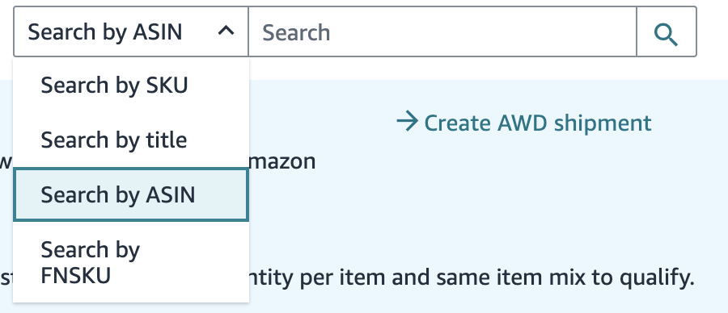

# halycon

utilities for Amazon SP API, mostly for my annoyances

- [halycon](#halycon)
  - [usage](#usage)
    - [pre-built binaries](#pre-built-binaries)
    - [build yourself](#build-yourself)
    - [go](#go)
  - [Utilities](#utilities)
    - [UPC to ASIN](#upc-to-asin)
      - [what](#what)
      - [why](#why)
      - [how](#how)
    - [ASIN to SKU](#asin-to-sku)
      - [why](#why-1)
      - [how](#how-1)
    - [Shipments from SKU Data](#shipments-from-sku-data)
      - [how](#how-2)
  - [halycon?](#halycon-1)

## usage

fill the `.halycon.dummy.yaml`, rename to `.halycon.yaml`, move the config to home directory, then

### pre-built binaries

i will upload binaries to releases soon tm

### build yourself

```bash
just build-current
mv ./dist/halycon /usr/local/bin/halycon
halycon --help
```

### go

```bash
GOPROXY=direct go install github.com/caner-cetin/halycon@latest
halycon --help
```

## Utilities
### UPC to ASIN

#### what

converts list of UPCs or a single UPC to ASIN

#### why

On `Send To Amazon` page, while creating shipment plans, you can search by SKU, Title, ASIN and FNSKU for the products you want to ship.



Guess what is missing? UPC!!!!!!!!!!!!

So whenever my brother sends a three page invoice to me like "create shipments for this", I have to do this 
```
switch tab -> fba inventory -> search with upc -> copy asin -> switch tab -> send to amazon -> search with asin -> enter quantity
```
for every single product.

`upc-to-asin` simplifies this process just to
```
send to amazon -> search with asin -> enter quantity
```
(dw, there is another command for creating shipment plans and skipping this process too)

#### how

single upc, for debugging purposes
```bash
halycon upc-to-asin --single --input 754603373000 -vvv
```
for list of upcs
```bash
halycon upc-to-asin --input list.txt --output out.txt
```
where list is newline delimited (one per line) text file
```bash
754603337000
...
```
output will be in same format.
```bash
B07H2WGKVB
...
```

### ASIN to SKU

#### why
for creating shipment plans, you need, SKU and ASIN's.
#### how

single asin, for debugging purposes
```bash
halycon asin-to-sku --single --input B07H2WGKVB -vvv
```
for list of asins
```bash
halycon asin-to-sku -vvv --input out.txt --output out.csv  
```
where input is list of ASIN's
```bash
B07H2WGKVB
...
```
and output will be
```
ASIN,SKU,Product Name,Quantity
B07H2WGKVB,some_sku,"Aneco 6 Pairs Over Knee Thigh Socks Knee-High Warm Stocking Women Boot Sock Leg Warmer High Socks for Daily Wear, Cosplay",
```
fill the quantity column and move on to `Shipments from SKU Data`


### Shipments from SKU Data

#### how
```bash
halycon shipment create -i sku.csv -v
```
where the input is the output of `asin-to-sku` command
```
ASIN,SKU,Product Name,Quantity
B07H2WGKVB,some_sku,"Aneco 6 Pairs Over Knee Thigh Socks Knee-High Warm Stocking Women Boot Sock Leg Warmer High Socks for Daily Wear, Cosplay",5
```

so for creating a shipment from list of UPCs (which is one of the main goals here), usual workflow is
```bash
halycon upc-to-asin      -i upc.txt -o asin.txt
halycon asin-to-sku      -i asin.txt -o sku.csv
halycon shipment create  -i sku.csv
```
then confirm and finalize the shipment on dashboard.


## halycon?

one of ma favourite mono song https://www.youtube.com/watch?v=2_OYaI37bi0